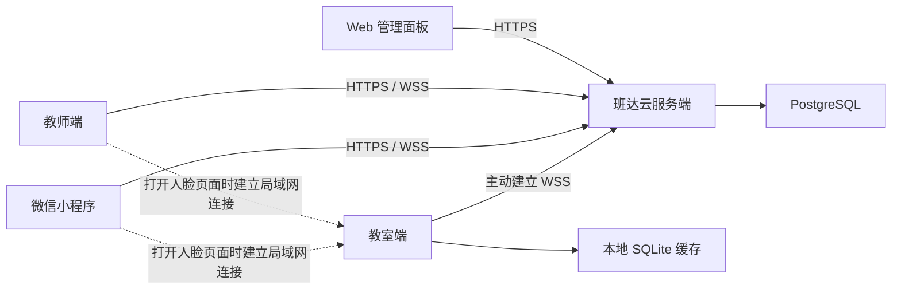
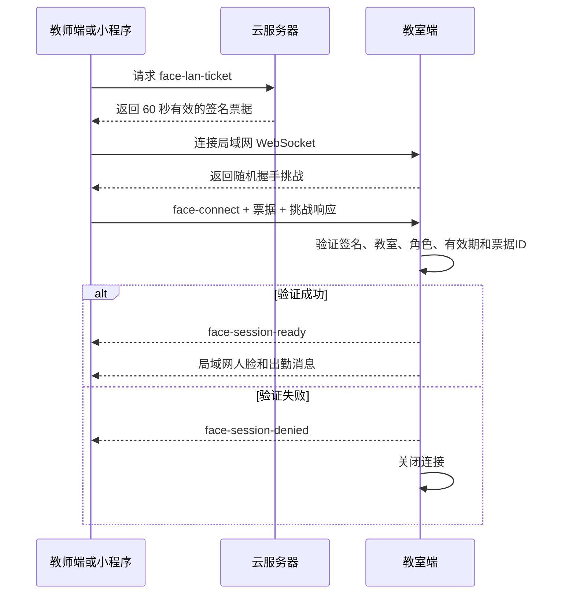

# 班达云服务完整实现方案

> 文档状态：已批准并进入实现
> 方案版本：1.0
> 更新日期：2026-08-15
> 当前阶段：第一版云服务、三端接入和局域网人脸旁路已实现

## 1. 项目目标

在保留现有局域网运行能力的基础上，为教室端、教师端和微信小程序增加可选的云服务模式。

云服务模式需要实现：

- 教室端通过服务器地址和教室接入密钥注册到云端。
- 教师账号、教室、教师成员和权限由云服务统一管理。
- 教师端和小程序可以通过互联网访问已经加入的教室。
- 呼叫、作业、通知、学生名单和教师成员等数据通过云端实时同步。
- 教室端只需要主动连接云服务器，不要求公网 IP、端口转发或固定 IP。
- 教室断网时能够继续运行必要的本地功能，并在恢复联网后同步数据。
- 原有纯局域网模式继续可用，用户可以选择使用哪种模式。

## 2. 明确不纳入云端的功能

云服务端不提供、存储、转发或备份任何人脸相关数据，包括：

- 摄像头画面和人脸截图。
- 人脸特征向量。
- 待匹配人脸库。
- 已匹配人脸库。
- 实时人脸检测结果。
- 基于人脸识别产生的出勤和在场状态。
- 人脸标注与匹配记录。

人脸识别始终在教室端本机运行。教师端或小程序只有与教室端处于同一局域网并成功完成局域网握手时，才能使用人脸和出勤页面。

云服务器可以签发短期局域网访问授权，但授权内容只能包含教师身份、教室身份、权限和有效期，不得包含任何人脸数据。

## 3. 设计原则

1. **兼容现有模式**：不破坏当前局域网连接码和 WebSocket 协议。
2. **云端权威**：云模式下，账号、教室资料、教师关系和教学数据以云数据库为准。
3. **人脸本地化**：人脸相关数据永远不离开教室所在局域网。
4. **最小权限**：连接密钥只用于首次注册，不能作为长期通用密码。
5. **主动连接**：教室端主动连接云端，避免学校网络开放入站端口。
6. **可撤销**：设备、账号、密钥和登录会话都可以被管理员单独吊销。
7. **可恢复**：断网、重连和重复消息不能造成重复操作或数据损坏。
8. **可审计**：重要管理操作在服务端留下审计记录。
9. **单一写入模式**：第一版不允许局域网模式和云模式同时修改同一教室。

## 4. 总体架构



### 4.1 运行模式

每个客户端支持以下连接模式：

#### 局域网模式

- 保持当前实现。
- 教师端和小程序通过连接码解析教室 IP。
- 教师直接连接 `ws://教室IP:3456`。
- 教室端 SQLite 是权威数据源。

#### 云服务模式

- 教师端、小程序和教室端连接云服务器。
- 云数据库是账号、教室和教学数据的权威来源。
- 教室端 SQLite 保存云端数据缓存、离线事件和本地人脸数据。
- 普通业务通过云端完成。
- 人脸功能临时建立额外的局域网连接。

第一版不提供自动混合模式。切换模式必须由用户明确确认，避免两套数据源同时写入。

## 5. 推荐技术选型

### 5.1 服务端

- Node.js 22
- TypeScript
- Fastify
- PostgreSQL 16 或更高版本
- `ws` 或 Fastify WebSocket 插件
- Drizzle ORM 或 Prisma
- Zod：请求和协议校验
- JOSE：Access Token、Refresh Token 和局域网授权票据
- Node.js `scrypt`：管理员密码哈希（避免新增原生部署依赖；使用独立随机盐和恒定时间比较）
- Pino：结构化日志

第一版采用模块化单体结构，不拆分微服务。这样部署、升级和排错成本更低。

### 5.2 Web 管理面板

- Vue 3
- TypeScript
- Vite
- Vue Router
- Pinia
- 基于原生 CSS 变量建立简洁管理界面

管理面板构建产物由 Fastify 直接托管，避免额外部署前端服务。

### 5.3 部署

- Docker Compose
- PostgreSQL 容器
- 云服务端容器
- Caddy 或 Nginx 负责 HTTPS/WSS
- 独立持久化卷保存数据库和服务端配置

第一版不强制 Redis。后续需要多实例运行、集中限流或横向扩展时再加入 Redis。

## 6. 建议目录结构

```text
cloud-server/
├── package.json
├── tsconfig.json
├── Dockerfile
├── docker-compose.yml
├── .env.example
├── migrations/
├── src/
│   ├── server.ts
│   ├── config/
│   ├── database/
│   ├── auth/
│   ├── enrollment/
│   ├── classrooms/
│   ├── teachers/
│   ├── assignments/
│   ├── realtime/
│   ├── audit/
│   └── admin/
├── admin-web/
│   ├── src/
│   └── vite.config.ts
└── test/

shared/
├── protocol/
│   ├── messages.js
│   ├── validation.js
│   └── version.js
└── cloud-client/
    ├── transport.js
    └── errors.js
```

共享协议模块必须保持为三端均可使用的纯 JavaScript，避免 Electron 和微信小程序构建环境不兼容。

## 7. 服务端核心模块

### 7.1 初始化模块

首次启动服务端时进入 `/setup`：

1. 检查数据库连接。
2. 创建第一个系统管理员。
3. 设置服务公开地址。
4. 生成服务端签名密钥。
5. 可选配置微信小程序 AppID 和 AppSecret。
6. 完成初始化后永久关闭公开初始化入口。

重新初始化只能通过服务器命令行执行，不能在未认证页面操作。

### 7.2 账号认证模块

支持以下登录方式：

- Web 管理员：账号和密码。
- 微信小程序：`wx.login()` 临时凭证换取云端会话。
- 教师端：小程序扫码确认登录。
- 备用方式：管理员生成一次性教师登录密钥。

服务端签发：

- Access Token：有效期建议 15 分钟。
- Refresh Token：有效期建议 30 天，可以按设备撤销。
- 局域网人脸访问票据：有效期建议 60 秒，只用于一次握手。

### 7.3 接入密钥模块

密钥分为：

| 前缀 | 用途 | 默认有效期 | 默认次数 |
|---|---|---:|---:|
| `ck_` | 教室端设备注册 | 24 小时 | 1 次 |
| `tk_` | 授权指定教师账号的客户端接入 | 7 天 | 1 次 |

密钥要求：

- 使用密码学安全随机数生成，至少 256 位随机性。
- 数据库只保存密钥哈希，不保存完整明文。
- `ck_` 分配给一个已创建的教室，`tk_` 分配给一个已创建的唯一教师账号。
- 密钥只完成实体客户端的首次身份授权，不携带加入教室、角色、授课科目、审批或其他业务行为。
- 可设置是否需要班主任或管理员审批。
- 使用成功后换取设备或账号令牌。
- 管理员可以随时吊销未使用密钥。

严禁把系统管理员主密钥直接配置到任何客户端。

### 7.4 教室设备网关

教室端使用 WSS 主动连接云服务：

```text
wss://server.example.com/ws/v1/classroom
```

网关负责：

- 设备认证。
- 设备在线状态。
- 教室配置同步。
- 呼叫消息下发。
- 作业和通知更新。
- 本地离线事件接收。
- 应用版本与心跳信息。
- 局域网连接码更新。

服务端不得通过该连接请求或接收人脸数据。

### 7.5 教师实时网关

教师端和小程序连接：

```text
wss://server.example.com/ws/v1/client
```

连接建立后按教室订阅，服务端根据成员权限决定可订阅范围。

## 8. Web 管理面板

### 8.1 仪表盘

- 教室总数。
- 在线教室数。
- 教师账号数。
- 当前在线教师数。
- 待审批成员数。
- 最近异常设备。
- 服务版本和数据库状态。

### 8.2 教室管理

- 创建、修改、停用和归档教室。
- 查看教室端设备状态。
- 查看最后在线时间和客户端版本。
- 生成教室接入密钥。
- 吊销或重新绑定教室设备。
- 管理班主任和教师成员。
- 查看学生名单、作业和通知。
- 不显示任何人脸或人脸出勤信息。

### 8.3 教师管理

- 创建、停用和删除教师账号。
- 查看教师加入的教室。
- 为已创建的教师账号生成客户端身份密钥。
- 撤销教师设备登录。
- 调整服务器级角色。
- 查看账号最近登录时间。

### 8.4 密钥管理

- 生成接入密钥。
- 设置类型、目标、有效期和次数。
- 复制一次性明文。
- 查看使用状态。
- 吊销未使用密钥。
- 记录创建人和使用人。

### 8.5 审计日志

记录以下操作：

- 管理员登录。
- 密钥生成、使用和吊销。
- 教室创建、停用和设备重绑。
- 教师审批、移除和班主任转让。
- 学生名单修改。
- 作业和通知新增、修改和删除。
- 登录设备撤销。

审计日志不记录作业正文之外的敏感请求内容，也不记录访问令牌和连接密钥明文。

## 9. 数据库设计

### 9.1 核心表

#### `organizations`

- `id`
- `name`
- `status`
- `created_at`
- `updated_at`

第一版界面可以只支持一个组织，但所有业务表保留 `organization_id`，避免以后重新迁移。

#### `users`

- `id`
- `organization_id`
- `name`
- `login_name`
- `password_hash`
- `wechat_openid`
- `server_role`
- `status`
- `created_at`
- `updated_at`

#### `user_devices`

- `id`
- `user_id`
- `device_name`
- `device_type`
- `refresh_token_hash`
- `last_seen_at`
- `revoked_at`

#### `classrooms`

- `id`
- `organization_id`
- `name`
- `status`
- `configured`
- `revision`
- `created_at`
- `updated_at`

#### `classroom_devices`

- `id`
- `classroom_id`
- `device_name`
- `device_token_hash`
- `status`
- `app_version`
- `lan_connection_code`
- `lan_status_updated_at`
- `last_seen_at`
- `revoked_at`

`lan_connection_code` 只用于帮助同一局域网内的客户端查找教室端，不包含人脸数据。

#### `classroom_members`

- `id`
- `classroom_id`
- `user_id`
- `role`
- `status`
- `subjects_json`
- `joined_at`
- `updated_at`

同一教室只允许一个有效班主任。

#### `students`

- `id`
- `classroom_id`
- `name`
- `sort_order`
- `status`
- `created_at`
- `updated_at`

#### `assignments`

- `id`
- `classroom_id`
- `creator_user_id`
- `subject`
- `type`
- `title`
- `publish_at`
- `deadline`
- `source`
- `status`
- `created_at`
- `updated_at`

#### `submissions`

- `assignment_id`
- `student_id`
- `status`
- `updated_by`
- `updated_at`

#### `enrollment_keys`

- `id`
- `organization_id`
- `key_type`
- `key_hash`
- `target_classroom_id`
- `role`
- `subjects_json`
- `expires_at`
- `max_uses`
- `used_count`
- `revoked_at`
- `created_by`
- `created_at`

#### `refresh_tokens`

- `id`
- `subject_type`
- `subject_id`
- `device_id`
- `token_hash`
- `expires_at`
- `revoked_at`

#### `operation_events`

- `id`
- `classroom_id`
- `revision`
- `operation_id`
- `event_type`
- `payload_json`
- `created_at`

#### `audit_logs`

- `id`
- `organization_id`
- `actor_type`
- `actor_id`
- `action`
- `target_type`
- `target_id`
- `ip_address`
- `metadata_json`
- `created_at`

### 9.2 明确禁止创建的云端表

云端不得创建以下类型的数据表：

- 人脸图片表。
- 人脸特征表。
- 待匹配人脸表。
- 实时人脸检测表。
- 人脸出勤表。

## 10. REST API 设计

统一前缀：

```text
/api/v1
```

### 10.1 系统与认证

```text
GET  /health
POST /api/v1/setup
POST /api/v1/auth/admin/login
POST /api/v1/auth/wechat
POST /api/v1/auth/refresh
POST /api/v1/auth/logout
GET  /api/v1/auth/devices
DELETE /api/v1/auth/devices/:deviceId
```

### 10.2 教室端接入

```text
POST /api/v1/enrollment/classroom/redeem
POST /api/v1/classroom-devices/refresh
GET  /api/v1/classroom-devices/me
POST /api/v1/classroom-devices/lan-status
```

### 10.3 教师接入

```text
POST /api/v1/enrollment/teacher/redeem
POST /api/v1/desktop-login/sessions
GET  /api/v1/desktop-login/sessions/:id
POST /api/v1/desktop-login/sessions/:id/approve
```

### 10.4 教室和成员

```text
GET    /api/v1/classrooms
POST   /api/v1/classrooms
GET    /api/v1/classrooms/:id
PATCH  /api/v1/classrooms/:id
GET    /api/v1/classrooms/:id/snapshot
GET    /api/v1/classrooms/:id/members
POST   /api/v1/classrooms/:id/members/:memberId/approve
PATCH  /api/v1/classrooms/:id/members/:memberId
DELETE /api/v1/classrooms/:id/members/:memberId
POST   /api/v1/classrooms/:id/transfer-homeroom
POST   /api/v1/classrooms/:id/leave
```

### 10.5 学生、作业和通知

```text
PUT    /api/v1/classrooms/:id/students
POST   /api/v1/classrooms/:id/assignments
PATCH  /api/v1/classrooms/:id/assignments/:assignmentId
DELETE /api/v1/classrooms/:id/assignments/:assignmentId
PATCH  /api/v1/classrooms/:id/assignments/:assignmentId/submissions/:studentId
POST   /api/v1/classrooms/:id/calls
```

### 10.6 局域网人脸授权

```text
POST /api/v1/classrooms/:id/face-lan-ticket
```

响应只包含：

- 教室 ID。
- 教师 ID。
- 教师角色。
- 允许的人脸操作范围。
- 一次性票据 ID。
- 签发时间和过期时间。
- 服务端数字签名。

此接口不接收或返回任何人脸内容。

## 11. WebSocket 协议

### 11.1 消息封装

```json
{
  "protocolVersion": 1,
  "id": "消息唯一ID",
  "type": "assignment.updated",
  "classroomId": "教室ID",
  "operationId": "操作唯一ID",
  "revision": 42,
  "timestamp": "2026-08-15T10:00:00.000Z",
  "payload": {}
}
```

### 11.2 主要事件

```text
session.ready
classroom.snapshot
classroom.updated
classroom.device.online
classroom.device.offline
classroom.member.pending
classroom.member.updated
classroom.member.revoked
assignment.created
assignment.updated
assignment.deleted
submission.updated
call.requested
call.displayed
permission.updated
error
ping
pong
```

云端协议中禁止出现：

```text
face-detections
pending-face-library
face-labeled
face-status
```

这些消息只允许存在于客户端与教室端之间的局域网连接。

### 11.3 呼叫处理

呼叫属于实时操作：

- 教室端在线时立即下发。
- 教室端收到后返回 `call.displayed`。
- 教室端离线时立即返回明确错误。
- 不在云端排队等待数小时后再显示，避免过期呼叫突然弹出。

作业、通知和成员修改属于持久化操作，服务器先保存，再等待教室端恢复在线后同步。

## 12. 数据同步与冲突控制

### 12.1 修订号

每个教室维护独立递增的 `revision`：

- 所有持久化修改在数据库事务中完成。
- 修改成功后增加教室修订号。
- 客户端保存最后收到的修订号。
- 重连时提交 `lastRevision`。
- 服务端返回增量事件或完整快照。

### 12.2 幂等操作

所有修改请求携带 `operationId`：

- 相同 `operationId` 重复提交时返回第一次执行结果。
- 避免断网重试导致重复发布作业或重复呼叫。
- 幂等记录至少保留 24 小时。

### 12.3 乐观并发控制

修改学生名单、班级配置和作业时携带 `expectedRevision`：

- 版本一致时执行修改。
- 版本冲突时返回 `REVISION_CONFLICT`。
- 客户端刷新最新数据后提示用户重新确认。

### 12.4 教室端离线队列

教室端 SQLite 增加本地 outbox：

- `operation_id`
- `event_type`
- `payload_json`
- `created_at`
- `retry_count`
- `last_error`
- `confirmed_at`

仅允许上传不涉及人脸的业务事件。

## 13. 局域网人脸旁路设计

### 13.1 基本约束

- 云模式下教室端仍监听现有局域网端口 `3456`。
- 普通云端业务不能通过该局域网连接修改数据。
- 只有人脸和本地出勤相关消息可以使用局域网旁路。
- 教师端或小程序只有进入人脸/出勤页面时才建立该连接。
- 离开页面后关闭连接并清空内存中的人脸数据。

### 13.2 局域网地址发现

按以下顺序尝试：

1. 使用教室端上报到云端的 `lan_connection_code`。
2. 解码连接码并尝试连接 `ws://局域网IP:3456`。
3. 教师桌面端可以使用 mDNS 发现作为备用方式。
4. 用户可以手动刷新教室端网卡和连接码。

教室端在以下情况更新连接码：

- 启动完成。
- 云端连接成功。
- 用户切换网卡。
- 网络地址变化。
- 每隔 60 秒发送一次状态心跳。

### 13.3 握手流程



票据采用服务端私钥签名，教室端只保存验证公钥。票据 ID 在教室端短期记忆，防止同一票据重复使用。

### 13.4 局域网允许的消息

```text
face-connect
face-session-ready
face-session-denied
face-detections
pending-face-library
face-labeled
face-status
face-label
face-reset-adaptive
ping
pong
```

云模式下，局域网连接收到作业、成员管理或学生名单修改消息时必须拒绝。

### 13.5 页面状态

人脸和出勤页面统一支持：

| 状态 | 页面提示 |
|---|---|
| 检测中 | 正在连接教室端的人脸服务… |
| 可用 | 已通过局域网连接教室端 |
| 不在同一局域网 | 当前设备无法通过局域网连接教室端，人脸服务暂不可用。 |
| 教室端离线 | 教室端未运行或尚未连接网络。 |
| 权限不足 | 当前账户没有查看该教室人脸信息的权限。 |
| 摄像头关闭 | 教室端已连接，但人脸识别功能未启用。 |
| 连接中断 | 与教室端的局域网连接已断开，人脸数据已停止更新。 |

失败状态提供“重新检测”按钮，并提示用户检查：

- 手机或教师电脑与教室电脑是否连接同一个 Wi-Fi/局域网。
- 是否启用了 VPN、代理或移动网络加速。
- 是否使用访客网络。
- 校园网络是否启用了终端隔离或 VLAN 隔离。
- 教室电脑防火墙是否允许 TCP 3456。
- 教室端选择的网卡是否正确。

页面必须注明：作业、通知、成员管理和呼叫等云端功能不受人脸局域网连接失败影响。

### 13.6 防止旧数据误显示

进入、退出或切换教室时必须：

1. 关闭旧的人脸局域网连接。
2. 清空旧教室的人脸、待匹配和出勤数据。
3. 显示“正在检测局域网连接”。
4. 只有新教室握手成功后才能显示数据。

不得在连接失败时继续展示上一个教室或上一次连接缓存的人脸结果。

## 14. 教室端改造方案

### 14.1 配置界面

新增“服务连接”设置：

- 连接模式：局域网 / 云服务。
- 云服务器地址。
- 教室接入密钥。
- 测试服务器连接。
- 当前服务器名称。
- 当前绑定教室。
- 教室设备 ID。
- 云端在线状态。
- 最近同步时间。
- 解除绑定。
- 重新注册。

接入密钥只在首次注册时输入，注册成功后从界面清除。

### 14.2 新增模块

```text
classroom-app/cloud/
├── config.js
├── api-client.js
├── cloud-agent.js
├── token-store.js
├── outbox.js
├── sync-engine.js
└── protocol-adapter.js
```

### 14.3 令牌保存

- 使用 Electron `safeStorage` 加密设备令牌。
- 数据库只保存加密后的令牌和非敏感配置。
- 日志禁止输出密钥、Access Token 和 Refresh Token。

### 14.4 本地数据

云模式下：

- 学生、教师、作业和通知是云端缓存。
- 人脸、特征向量、待匹配库和人脸出勤是本地权威数据。
- 学生从云端删除时，教室端同步删除对应本地人脸映射，但操作前保留短期可恢复备份。
- 本地人脸数据库永远不加入云端 outbox。

### 14.5 呼叫

云端呼叫到达教室端后复用现有呼叫队列和弹窗。

教室端返回：

- 已收到。
- 已显示。
- 显示失败。

## 15. 教师端改造方案

### 15.1 连接抽象

把当前页面直接创建 WebSocket 的逻辑抽象为：

```text
ClassroomTransport
├── LanTransport
└── CloudTransport
```

统一暴露：

```text
connectClassroom
disconnectClassroom
subscribe
requestSync
sendCall
updateAssignment
updateSubmission
updateClassroom
manageTeacher
leaveClassroom
```

现有 UI 不关心底层使用局域网还是云端。

### 15.2 云服务配置

- 服务器地址。
- 测试连接。
- 登录服务器。
- 当前服务器账号。
- 已登录设备。
- 退出服务器。
- 删除服务器配置。

教师端可以保存多个服务器配置，但同一时间只激活一个服务器。

### 15.3 教师端登录

推荐流程：

1. 教师端输入服务器地址。
2. 教师端向服务器创建扫码登录会话。
3. 显示只包含服务器地址和登录会话 ID 的二维码。
4. 已登录小程序扫码确认。
5. 教师端通过轮询或 WSS 获得设备令牌。
6. 后续自动刷新登录。

教师端可以使用管理员分配给该教师账号的 `tk_` 身份密钥接入，也可以沿用小程序扫码同步云会话。

### 15.4 人脸页面

教师端保持云端连接，同时单独创建 `FaceLanTransport`：

```text
CloudTransport  —— 普通业务持续在线
FaceLanTransport —— 仅人脸页面打开期间存在
```

人脸局域网失败不得断开云端，也不得影响其他页面。

## 16. 微信小程序改造方案

### 16.1 配置入口

在“我的”页面增加服务连接区域：

- 当前服务器。
- 服务器连接状态。
- 输入邀请密钥。
- 扫描服务器接入二维码。
- 退出服务器账号。
- 删除本地服务器数据。

### 16.2 微信平台限制

小程序不能真正连接任意用户填写的地址。云服务器必须满足：

- 使用 HTTPS 和 WSS。
- 使用可信 CA 签发的 TLS 证书。
- 使用域名，不能直接使用公网 IP。
- 域名已加入微信公众平台的 request 合法域名。
- WSS 域名已加入 socket 合法域名。
- 不使用非标准或被微信限制的端口。

因此桌面客户端可以配置任意可信服务器，而正式小程序只能连接发布前已经加入微信域名白名单的服务器。

### 16.3 微信登录

1. 小程序调用 `wx.login()`。
2. 将临时 code 发送给云服务器。
3. 云服务器使用保存在服务端的 AppID/AppSecret 换取微信身份。
4. 首次登录输入管理员分配给该教师账号的 `tk_` 身份密钥。
5. 绑定成功后服务器签发该唯一教师账号的小程序会话。
6. 教室成员关系由教室端同步或云管理员维护，不通过登录密钥建立。
7. 后续启动自动刷新会话并同步账号名下教室。

AppSecret 只能保存在云服务器环境变量或密钥管理服务中，不能提交到仓库或写入小程序。

### 16.4 人脸页面

小程序进入出勤或人脸匹配页面时：

- 向云端申请短期局域网票据。
- 使用教室连接码解析局域网 IP。
- 尝试 `wx.connectSocket` 或当前可用的局域网连接方式。
- 五次尝试均失败后停止自动重试并显示引导。
- 页面退出时关闭连接并清空人脸数据。

## 17. 权限模型

### 17.1 系统管理员

- 管理服务器配置、账号、教室、设备和密钥。
- 不能查看人脸数据。

### 17.2 班主任

- 修改教室资料和学生名单。
- 审核、移除教师。
- 转让班主任。
- 设置本人授课科目。
- 管理全部作业和通知。
- 在局域网连接成功时查看和匹配人脸。

### 17.3 任课教师

- 查看已加入教室。
- 修改本人授课科目的作业。
- 发布通知。
- 更新作业提交状态。
- 使用呼叫功能。
- 是否允许查看局域网实时出勤由教室权限决定。
- 不能查看待匹配人脸库。

### 17.4 教室端设备

- 只访问绑定教室。
- 接收呼叫和普通业务快照。
- 上报设备状态和非人脸业务事件。
- 不允许创建教师账号或修改服务器级权限。

## 18. 安全方案

### 18.1 网络安全

- 云端只开放 HTTPS/WSS。
- 禁止明文 HTTP 登录。
- 配置 HSTS。
- 限制请求大小。
- 登录、密钥兑换和二维码会话必须限流。
- WebSocket 每条消息进行身份、教室和权限校验。

### 18.2 令牌安全

- Access Token 短期有效。
- Refresh Token 按设备保存和撤销。
- 数据库只保存 Refresh Token 哈希。
- 接入密钥只显示一次。
- 客户端不保存已使用的接入密钥。
- 日志自动脱敏 Authorization、Cookie、密钥和二维码会话 ID。

### 18.3 管理面板

- 管理员密码使用 Argon2id。
- Cookie 设置 `HttpOnly`、`Secure` 和 `SameSite=Strict`。
- 修改密码、生成密钥和删除设备需要重新验证。
- 所有管理写操作进行 CSRF 防护。

### 18.4 局域网人脸访问

- 使用短期、单次、带签名的局域网票据。
- 票据绑定教室、教师、角色和操作范围。
- 教室端验证签名，不向云端查询人脸数据。
- 票据过期或重复使用立即拒绝。
- 连接关闭后清理票据和人脸数据。

## 19. 数据迁移方案

### 19.1 教室端首次接入云端

提供两种方式：

#### 创建空白云教室

- 使用 `ck_` 密钥绑定管理员预先创建的教室。
- 从云端下载教室资料。
- 不上传本地旧数据。

#### 上传当前教室

- 班主任确认迁移。
- 上传班级名称、学生、教师成员、科目、作业、通知和提交状态。
- 不上传任何人脸和人脸出勤数据。
- 云端创建初始快照。
- 成功后切换到云端权威模式。

### 19.2 教师账号迁移

- 保留现有 `connectionId` 作为 `legacy_connection_id`。
- 教师通过邀请密钥或微信登录绑定云账号。
- 已有教室成员关系需要班主任确认后映射到云账号。
- 不根据姓名自动合并账号。

### 19.3 回退

- 切换回局域网模式前必须导出最新云端快照。
- 回退操作创建本地数据库备份。
- 人脸数据库不受模式切换影响。
- 云端数据不会因客户端退出而自动删除。

## 20. 配置项

### 20.1 服务端环境变量

```text
PUBLIC_URL=https://server.example.com
DATABASE_URL=postgresql://...
ACCESS_TOKEN_PRIVATE_KEY=...
ACCESS_TOKEN_PUBLIC_KEY=...
REFRESH_TOKEN_SECRET=...
SETUP_TOKEN=...
WECHAT_APP_ID=...
WECHAT_APP_SECRET=...
LOG_LEVEL=info
TRUST_PROXY=true
```

`.env.example` 只能放占位符，真实密钥不得提交到 Git。

### 20.2 教室端本地配置

```text
connectionMode
cloudServerUrl
cloudClassroomId
cloudDeviceId
encryptedDeviceToken
lastCloudRevision
```

### 20.3 教师端本地配置

```text
connectionMode
cloudProfiles
activeCloudProfileId
encryptedRefreshToken
activeClassroomId
```

### 20.4 小程序本地配置

```text
cloudServerUrl
cloudSession
activeClassroomId
lastRevisionByClassroom
```

小程序保存前必须验证服务器域名是否属于允许列表。

## 21. 错误码规范

```text
AUTH_REQUIRED
TOKEN_EXPIRED
TOKEN_REVOKED
ENROLLMENT_KEY_INVALID
ENROLLMENT_KEY_EXPIRED
ENROLLMENT_KEY_USED
PERMISSION_DENIED
CLASSROOM_NOT_FOUND
CLASSROOM_OFFLINE
DEVICE_REVOKED
REVISION_CONFLICT
OPERATION_DUPLICATE
RATE_LIMITED
PROTOCOL_VERSION_UNSUPPORTED
FACE_LAN_UNAVAILABLE
FACE_LAN_PERMISSION_DENIED
FACE_SERVICE_DISABLED
```

客户端根据错误码显示统一提示，不直接展示服务端内部错误和堆栈。

## 22. 日志、监控和备份

### 22.1 日志

- JSON 结构化日志。
- 每个请求包含 request ID。
- 每个 WebSocket 连接包含 session ID。
- 敏感字段自动脱敏。
- 不记录学生完整数据快照。
- 不记录任何人脸数据。

### 22.2 健康检查

```text
GET /health/live
GET /health/ready
```

检查：

- 应用进程。
- PostgreSQL。
- 数据库迁移版本。
- WebSocket 网关。

### 22.3 备份

- PostgreSQL 每日备份。
- 至少保留 7 个每日备份和 4 个每周备份。
- 定期执行恢复演练。
- 备份加密保存。
- 备份中不包含人脸数据。

## 23. 测试方案

### 23.1 服务端单元测试

- 密钥生成、兑换、过期和吊销。
- Token 刷新和设备撤销。
- 权限矩阵。
- 班主任唯一性。
- 科目权限。
- 修订号和幂等操作。
- 参数长度和非法输入。

### 23.2 API 集成测试

- 教室注册完整流程。
- 教师身份密钥兑换、教室端成员同步和管理员成员配置。
- 教师端扫码登录。
- 教室快照同步。
- 作业、通知和提交状态修改。
- 班主任转让。
- 教师退出教室。

### 23.3 WebSocket 测试

- 重连和恢复订阅。
- 重复消息。
- 消息乱序。
- 教室离线。
- 权限变更后立即撤销连接。
- 呼叫确认和超时。
- 协议版本不兼容。

### 23.4 人脸旁路测试

- 云端在线且局域网连接成功。
- 云端在线但不在同一局域网。
- 教室端关闭。
- 网卡选择错误。
- 票据过期。
- 票据重复使用。
- 普通教师尝试人脸标注。
- 切换教室后旧人脸数据被清空。
- 局域网人脸失败不影响云端功能。
- 确认网络请求中没有人脸数据发送到云服务器。

### 23.5 客户端回归测试

- 原局域网模式全部功能不受影响。
- 云端模式首次注册和重新登录。
- Windows 和 macOS 安装包。
- 教室端断网缓存和恢复同步。
- 教师端五次重连提示。
- 小程序前后台切换和 Token 刷新。
- 深色模式和不同尺寸设备。

### 23.6 安全测试

- 越权访问其他教室。
- 重放接入密钥。
- 重放局域网人脸票据。
- WebSocket 伪造身份。
- SQL 注入和 XSS。
- 暴力登录和接口限流。
- 日志和错误响应敏感信息检查。

## 24. 实施顺序

### 阶段 1：共享协议和服务端骨架

- 创建 `cloud-server`。
- 创建共享协议模块。
- 建立 PostgreSQL 迁移。
- 完成健康检查和基础测试。

验收：服务端可以通过 Docker Compose 启动，数据库迁移可重复执行。

### 阶段 2：认证、密钥和管理面板

- 首次初始化。
- 管理员登录。
- 教室和教师接入密钥。
- 教室、教师和设备管理。
- 审计日志。

验收：管理员可以在 Web 页面生成密钥并管理设备。

### 阶段 3：教室端云连接

- 增加模式和服务器配置。
- 完成设备注册。
- 完成云端 WSS。
- 完成缓存和 outbox。
- 接入呼叫显示。

验收：互联网中的服务端可以向教室端实时发送呼叫。

### 阶段 4：教师端云连接

- 抽象 Transport。
- 增加云服务配置。
- 完成扫码登录。
- 接入教室、学生、作业、通知和成员管理。

验收：教师端在不同网络中可以操作云教室。

### 阶段 5：局域网人脸旁路

- 增加局域网票据。
- 增加 `FaceLanTransport`。
- 改造教师端人脸页面状态。
- 验证人脸数据不经过云端。

验收：同一局域网可用，离开局域网明确提示不可用，其他云端功能正常。

### 阶段 6：小程序云接入

- 微信登录。
- 指定教师云账号的身份密钥绑定。
- 云端教室和业务页面。
- 小程序人脸局域网旁路。
- 合法域名和真机测试。

验收：小程序通过互联网使用普通业务，同一局域网时可进入人脸页面。

### 阶段 7：迁移、运维和发布

- 本地教室迁移。
- 备份和恢复。
- 限流和安全检查。
- GitHub Actions 服务端测试和镜像构建。
- 完整端到端回归。

## 25. 最终验收标准

项目全部完成时必须满足：

- 原有局域网模式仍然可用。
- 云服务可以通过 Docker Compose 独立部署。
- 教室端可以使用一次性密钥完成注册。
- 教师账号和教室成员由云端统一管理。
- 教师端和小程序可以通过互联网使用呼叫、作业、通知和成员管理。
- 教室端不需要公网 IP 或开放入站端口。
- 云端断线不会损坏教室端数据。
- 重连不会产生重复作业或重复成员。
- 人脸数据不会出现在云端数据库、日志、API 或 WebSocket 中。
- 人脸页面只在局域网握手成功后显示数据。
- 人脸连接失败时显示明确提示且不影响云端功能。
- 切换教室不会显示上一教室的人脸数据。
- 所有权限操作都有服务端验证，不能只依赖前端隐藏按钮。
- 管理员可以吊销密钥、账号、设备和会话。
- Windows、macOS 和微信真机测试通过。

## 26. 开始开发前需要确认的决策

建议采用以下默认选项：

1. 使用 PostgreSQL，不使用服务器 SQLite。
2. 第一版为单组织，但数据库保留多组织字段。
3. 使用 Docker Compose 部署。
4. 第一版不引入 Redis。
5. 云端为普通业务唯一权威数据源。
6. 局域网模式与云模式由用户明确选择，不自动双写。
7. 人脸和人脸出勤完全保留在教室端。
8. 人脸页面使用短期签名票据完成局域网授权。
9. 教师端主要通过小程序扫码登录，保留一次性登录密钥作为备用方式。
10. 小程序只支持已经加入微信合法域名列表的服务器。

以上决策确认后，再按照第 24 节的顺序开始修改代码。

## 27. 第一版实现结果（2026-08-15）

本轮已经落地以下内容：

- 新增 `cloud-server/`：Fastify、PostgreSQL、REST、WSS、迁移、Docker Compose、管理面板、审计、连接密钥、设备吊销和成员管理。
- 教室端新增托盘“云服务设置”，使用 `ck_` 密钥注册，主动建立出站 WSS 桥接，并使用系统安全存储保护设备令牌。
- 教师端新增云服务设置和云教室传输层；小程序扫码登录教师端时可同步云会话。
- 小程序新增统一教师云账号接入、长期会话刷新、多云教室统计和云教室页面路由。
- 云端支持普通教学快照、离线修改、水位同步和教室恢复上线后的反向恢复。
- 云桥会从 `sync` 中删除出勤、待匹配人脸和实时人脸字段；服务端还会递归拒绝疑似人脸图片、特征或生物识别数据。
- 教师端与小程序的出勤页面会另行使用连接码访问教室端局域网服务；失败时显示“当前局域网连接失败，人脸服务不可用”。
- 教室端 `ck_` 与教师端 `tk_` 都只用于实体连接授权。教师成员关系、身份和授课科目来自教室端同步或云管理员配置，不再存在行为型成员密钥。
- 管理员账号只在管理面板使用，不计入教师数量或教师列表，管理员 JWT 不能接入教师 WebSocket。
- 生产客户端强制 HTTPS/WSS；访问令牌绑定设备记录，REST 与 WebSocket 校验客户端类型和协议版本，WebSocket 凭证在加密通道建立后发送而不写入 URL。

实现时采用了两项审慎调整：

1. 管理员密码使用 Node.js 内置 `scrypt`，避免 Argon2 原生模块给 Windows、macOS 与容器部署增加新的二进制链路。
2. 第一版人脸局域网握手复用现有已批准教师身份，云端不签发也不接触任何人脸票据或内容；云身份只通过教室端本机随机密钥保护的回环桥接通道导入。

自动验证已覆盖 TypeScript 构建、共享协议、隐私边界、三端 JavaScript 语法和现有单元测试。完整 PostgreSQL/多设备联调需在 Docker 服务可用时按第 23 节环境执行。
