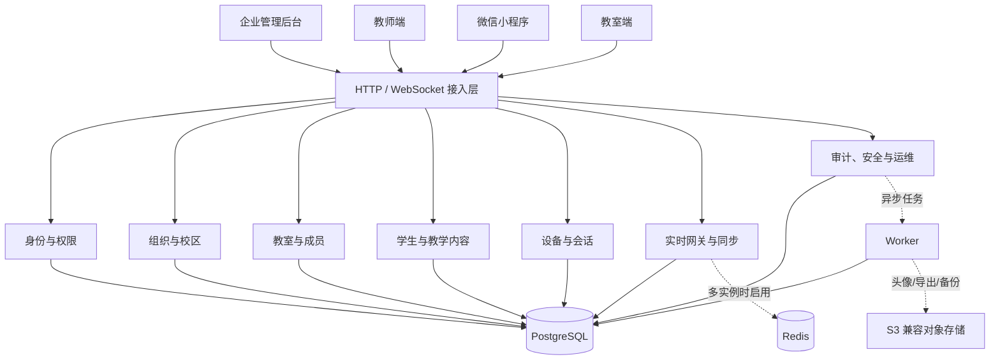

# 班达云服务企业级后端升级设计方案

> 文档状态：已确认，实施中
> 方案版本：2.2
> 更新日期：2026-08-26
> 适用范围：`cloud-server`、云端管理后台及三端新版云协议

## 1. 结论与推荐路线

本次升级不建议直接拆成微服务。推荐以 **NestJS + Fastify Adapter** 为成熟后端框架基础，把现有云服务重构为一个边界清晰、可独立测试和演进的“企业级模块化单体”。保留 PostgreSQL 作为权威数据源，并通过任务队列、事件表、缓存和对象存储接口获得横向扩展能力。

推荐目标形态：

- 单套代码支持私有化单组织部署和 SaaS 多租户部署。
- 平台、组织、校区、教室四级管理边界。
- RBAC 角色权限与数据范围授权相结合，所有权限由服务端强制执行。
- 管理后台覆盖组织、用户、教室、设备、内容、审计、安全、系统配置和运维管理。
- REST API、WebSocket、后台任务、数据库访问分别建立稳定边界。
- 仅提供 `/api/v2`、`/ws/client` 和 `/ws/classroom`；旧版 API、WebSocket 与原生管理页面全部移除。
- 云端继续禁止保存、处理或转发人脸图片、特征向量、裁剪图和实时人脸结果。

## 2. 现状评估

### 2.1 已有能力

当前第一版已经具备：

- Fastify + TypeScript + PostgreSQL 服务端。
- 初始化、管理员登录、教师账号、教室和成员管理；不提供接入密钥配置。
- 教师与教室设备注册、Access Token、Refresh Token 和设备吊销。
- 教室快照、增量事件、修订号、幂等操作和 WebSocket 实时桥接。
- 组织品牌、学生、作业、通知、提交状态和基础审计记录。
- Docker Compose、健康检查、迁移和备份脚本。
- 云端人脸数据识别与拒绝边界。

因此，本次工作定义为基于既有数据迁移链的全量应用重构；保留可升级的数据，不保留旧应用协议与实现。

### 2.2 与标准企业后端的主要差距

1. 服务端约 1300 行逻辑集中在 `server.ts`，路由、鉴权、SQL、同步和实时连接耦合，难以分工、测试和审计。
2. 只有 `admin`、`teacher` 和教室内角色，缺少平台管理员、组织管理员、校区管理员、审计员、运维员等职责分离。
3. 虽有 `organization_id`，但租户隔离没有形成统一的数据访问策略，部分查询依赖调用处手工带条件。
4. 管理后台只覆盖核心对象，缺少组织层级、管理员、设备会话、审计检索、安全策略、批量导入导出、回收站和运维中心。
5. 登录限流保存在单进程内存中，多实例无效；没有统一限流、会话风险控制、MFA、密码策略和登录审计。
6. WebSocket 在线状态和连接映射保存在进程内，多实例时不能跨节点广播。
7. 审计表已有写入，但没有完整查询、导出、留存、防篡改和敏感字段脱敏策略。
8. 缺少后台任务、通知重试、Outbox、死信、数据保留、对象存储和异步导入导出能力。
9. 只有基础健康检查，缺少指标、追踪、告警、作业状态、备份恢复验证及灾备目标。
10. 测试以静态回归和单元测试为主，数据库集成、权限矩阵、并发、恢复和端到端测试不足。

## 3. 目标、边界与非目标

### 3.1 目标

- 支持 1 个平台管理多个组织，每个组织管理多个校区、学年、班级/教室和教师。
- 支持企业职责分离、细粒度授权、操作审批和完整审计。
- 支持单实例私有化起步，并能平滑扩为多实例高可用部署。
- 提供稳定、版本化、可观测、可回滚的 API 与同步协议。
- 管理面板能完成日常运营，不依赖直接操作数据库。
- 发布过程可灰度、可回退，所有客户端必须切换到新版协议后再进入生产。

### 3.2 继续坚持的边界

- 人脸数据始终只在教室本地和局域网内处理。
- 云端不创建人脸、特征、检测、图片或人脸出勤相关数据表。
- 客户端上传内容继续执行入口检查，日志与审计也不得记录被禁止数据。
- 局域网模式继续独立可用；云模式下云数据库是普通业务数据的权威来源。

### 3.3 本期非目标

- 不在第一阶段拆分大量微服务。
- 不在第一阶段引入 Kubernetes 作为强制部署条件。
- 不改变已有客户端的核心交互和人脸旁路设计。
- 不把 BI、财务计费或家长端扩展混入本次后端重构；仅预留接口。

## 4. 总体架构



### 4.1 部署档位

| 档位 | 组成 | 适用场景 |
|---|---|---|
| 基础版 | API 单实例 + PostgreSQL + 本地文件 | 小型私有部署、开发测试 |
| 标准版 | API 多实例 + PostgreSQL + Redis + Worker + S3 | 正式生产、多个校区 |
| 高可用版 | API/Worker 多副本 + PostgreSQL HA + Redis HA + S3 + LB | SaaS 或大型集团 |

业务代码使用端口适配器隔离 Redis、存储和任务队列。未启用 Redis 时可用进程内适配器，但生产多实例必须启用共享适配器。

### 4.2 成熟框架选型

#### 最终推荐

| 层次 | 选型 | 用途 |
|---|---|---|
| 后端应用框架 | NestJS 当前稳定版 | 模块、依赖注入、Guard、Interceptor、Filter、测试与生命周期 |
| HTTP 引擎 | `@nestjs/platform-fastify` + Fastify 5 | 保留现有 Fastify 性能、插件和部署经验 |
| 管理后台基座 | Vue Vben Admin 5 | 企业菜单、动态路由、权限、主题、国际化和页面布局 |
| UI 与表格 | Vben 默认组件体系 + VXE Table | 大数据表格、筛选、批量操作和导入预览 |
| 数据库 | PostgreSQL | 权威业务数据、事务、审计和 Outbox |
| 数据访问 | Prisma ORM 当前稳定版 + 受控原生 SQL | 普通 CRUD 类型安全；复杂同步、锁和批量操作保留显式 SQL |
| 缓存与分布式能力 | Redis | 限流、在线状态、缓存、跨实例广播和队列 |
| 后台任务 | NestJS BullMQ 集成 | 导入导出、通知、统计、重试和死信 |
| API 文档 | `@nestjs/swagger` | 从 DTO 与装饰器生成 OpenAPI |
| 健康检查 | `@nestjs/terminus` | 数据库、Redis、存储和 Worker 就绪检查 |
| 可观测性 | Pino + OpenTelemetry + Prometheus | 日志、追踪、指标和告警 |

#### 为什么选择 NestJS

- 与现有 Node.js、TypeScript、Fastify 和 pnpm 技术栈一致，不需要引入 Java 团队和第二套运行环境。
- Module、Controller、Provider 和依赖注入为大型后端提供统一工程约束，解决当前逻辑集中在单文件的问题。
- Guard 和自定义 Decorator 适合实现 `@RequirePermissions()`、租户范围和科目范围授权。
- Interceptor、Exception Filter 和 Pipe 可统一完成响应、审计、错误、参数校验和请求上下文。
- 官方能力覆盖 WebSocket、OpenAPI、缓存、队列、定时任务、限流、健康检查和微服务传输层。
- Fastify Adapter 允许继续使用 Fastify 作为底层 HTTP 平台，减少协议和性能层面的迁移风险。
- 如果未来需要拆服务，同一领域模块可以迁移到独立 NestJS 应用，并选择 Redis、NATS、RabbitMQ、Kafka 或 gRPC 作为通信层。

#### 为什么不直接选其他方案

| 方案 | 结论 | 原因 |
|---|---|---|
| 继续裸 Fastify | 不作为主方案 | Fastify 插件封装能力很好，但团队仍需自行制定依赖注入、模块、权限、任务和测试约定，容易再次形成自由结构 |
| Spring Boot | 暂不采用 | 企业生态最完整，但需要把现有 TypeScript 后端迁移到 Java，迁移量、人员要求和双栈维护成本过高 |
| 若依/RuoYi 类整套系统 | 不直接采用 | 自带组织权限和代码生成，但其 Java 数据模型、前端约定和通用 CRUD 很难直接适配现有三端协议、离线同步和人脸隐私边界 |
| 微服务脚手架 | 暂不采用 | 现在的首要问题是领域和权限边界，不是服务数量；过早拆分会引入分布式事务和运维成本 |

#### Prisma 使用边界

- 现有数据库已经包含生产迁移链，接入时先执行 introspection/baseline，不重置数据库。
- Prisma 负责组织、用户、权限、校区、配置等标准 CRUD。
- 教室快照合并、`SELECT ... FOR UPDATE`、Outbox 抢占、批量 upsert 等复杂路径允许使用参数化原生 SQL。
- 数据库迁移必须经过 SQL 审核；生产只执行 CI 产出的迁移，不允许运行 `db push`。
- Repository 是唯一数据访问入口，Controller 和业务 Service 不直接调用 Prisma 或 SQL。

## 5. 代码架构

推荐按领域拆分，而不是按技术层建立全局大目录：

```text
cloud-server/
├── src/
│   ├── main.ts              # NestFactory + FastifyAdapter 启动入口
│   ├── app.module.ts        # 根模块，只负责装配
│   ├── platform/            # Config/Database/Redis/Queue/Storage 模块
│   ├── common/              # Guard、Filter、Interceptor、Decorator、DTO
│   ├── modules/
│   │   ├── identity/        # 登录、MFA、Token、会话、密码策略
│   │   ├── authorization/   # 角色、权限、数据范围、策略判定
│   │   ├── tenants/         # 平台租户与组织生命周期
│   │   ├── campuses/        # 校区、部门、学年学期
│   │   ├── users/           # 用户、管理员、教师、批量导入
│   │   ├── classrooms/      # 教室、成员、科目、学生
│   │   ├── teaching/        # 作业、通知、提交状态
│   │   ├── devices/         # 设备状态、心跳与版本策略
│   │   ├── sync/            # 快照、增量、幂等、冲突处理
│   │   ├── realtime/        # WebSocket、在线状态、广播
│   │   ├── files/           # 头像、导入导出、对象存储
│   │   ├── audit/           # 审计、登录事件、安全事件
│   │   └── operations/      # 任务、健康、指标、系统设置
│   └── workers/             # BullMQ Processor，可独立启动 Worker
├── admin-web/               # Vue Vben Admin 5 独立应用
│   ├── apps/web-antd/
│   └── packages/            # API client、权限、共享组件和主题
├── prisma/                  # Prisma schema 与基线信息
├── migrations/
├── test/
│   ├── unit/
│   ├── integration/
│   ├── contract/
│   └── e2e/
└── openapi/
```

每个业务模块包含 `module`、`controller`、`dto`、`service`、`repository`、`policies` 和模块测试。Controller 不直接写 SQL，Repository 不做权限决策，权限必须通过 Guard 和 Service/Policy 层统一判断。

## 6. 租户、组织与权限模型

### 6.1 管理层级

```text
平台 Platform
└── 组织 Organization（学校或教育集团）
    ├── 校区 Campus
    │   ├── 部门 Department
    │   └── 教室 Classroom
    └── 组织级用户、角色、策略和配置
```

私有化单组织部署仍保留一个隐式平台和一个组织，界面可隐藏平台层级。

### 6.2 推荐角色

| 角色 | 默认数据范围 | 核心能力 |
|---|---|---|
| 平台超级管理员 | 全平台 | 租户、平台配置、平台运维，不读取教学正文为默认原则 |
| 平台运维员 | 全平台运行状态 | 健康、任务、版本、告警，无业务修改权限 |
| 组织所有者 | 单组织 | 组织全部管理及管理员授权 |
| 组织管理员 | 单组织 | 用户、校区、教室、设备、内容管理 |
| 校区管理员 | 指定校区 | 校区内用户、教室、设备管理 |
| 安全审计员 | 指定组织/校区只读 | 审计、安全事件、会话检查和导出 |
| 内容管理员 | 指定组织/校区 | 作业、通知、学生数据治理 |
| 班主任 | 指定教室 | 教室、成员、学生和全部学科内容 |
| 任课教师 | 指定教室与学科 | 授权学科内容和提交状态 |
| 教室设备 | 单教室 | 同步、状态和允许的设备事件 |

### 6.3 授权机制

- RBAC：角色映射权限编码，例如 `user.read`、`classroom.manage`、`audit.export`。
- 数据范围：`platform`、`organization`、`campus`、`classroom`、`self`。
- ABAC 补充：成员状态、授课科目、资源创建者、设备状态、组织策略。
- 默认拒绝；前端隐藏按钮不构成权限控制。
- 权限变更后递增用户 `auth_version`，旧 Access Token 和 WebSocket 在短时间内失效。
- 平台跨租户操作必须指定原因，并进入单独的高风险审计流。

所有租户业务表必须包含 `organization_id`，Repository 查询由请求上下文强制注入租户条件。高保证部署可额外启用 PostgreSQL Row Level Security 作为纵深防御，但不能代替应用权限测试。

## 7. 核心数据模型升级

### 7.1 新增或重构的核心表

| 领域 | 建议表 |
|---|---|
| 租户组织 | `organizations`、`organization_settings`、`campuses`、`departments`、`academic_terms` |
| 身份权限 | `users`、`roles`、`permissions`、`role_permissions`、`user_role_bindings` |
| 安全会话 | `user_devices`、`sessions`、`refresh_token_families`、`login_events`、`mfa_methods` |
| 教室教学 | `classrooms`、`classroom_members`、`subjects`、`students`、`assignments`、`submissions` |
| 设备运行 | `classroom_devices`、`device_events`、`client_versions` |
| 同步任务 | `operation_events`、`sync_checkpoints`、`outbox_events`、`background_jobs` |
| 治理审计 | `audit_logs`、`security_events`、`data_exports`、`deletion_requests` |
| 文件 | `file_objects`，只存对象元数据；二进制进入对象存储 |

### 7.2 数据规范

- 主键统一 UUID；需要兼容本地 ID 的实体同时保留 `external_id`，使用 `(organization_id, source, external_id)` 唯一约束。
- 业务状态使用数据库约束或受控枚举，不接受任意字符串。
- 所有可修改表统一包含 `created_at`、`updated_at`，必要时增加 `created_by`、`updated_by`。
- 管理对象默认软删除，使用 `deleted_at`、`deleted_by` 和回收站；认证密钥等敏感对象采用吊销且不可恢复。
- 写操作支持 `request_id`/`operation_id` 幂等键，关键写入使用事务。
- 审计日志只追加，不允许普通管理 API 更新或删除。
- 对大表按租户、时间和访问模式建立复合索引；事件与审计表达到规模后按月份分区。
- 定义数据保留策略：在线事件、登录日志、审计、导出文件和已删除数据分别配置期限。

### 7.3 隐私约束

- 数据库迁移和代码检查中加入禁止人脸相关表名/字段名的自动规则。
- API、WebSocket、任务队列、日志和对象存储入口共用同一个隐私检查器。
- 学生姓名属于敏感教学数据：导出需要权限和审计，日志不得记录完整请求体。

## 8. 企业管理后台功能

### 8.1 总览

- 组织、校区、教室、教师和学生数量。
- 教室设备在线率、异常设备、客户端版本分布。
- 登录失败、安全事件、待处理审批和后台任务失败。
- 作业/通知与同步趋势，支持按组织、校区和时间筛选。

### 8.2 组织与校区

- 组织创建、停用、归档、品牌和功能开关。
- 校区、部门、学年学期和数据范围配置。
- 组织配额：管理员、教师、教室、设备、存储和导出并发数。
- 私有化部署的许可证/授权状态预留，不在本期实现计费。

### 8.3 用户与管理员

- 管理员与教师分栏管理，角色及数据范围授权。
- 邀请、批量创建、CSV/XLSX 导入、模板下载和失败行报告。
- 重置密码、强制下线、撤销设备、冻结账号、解锁和离职交接。
- 用户详情展示角色、教室、设备、会话、登录历史和近期操作。
- 支持按姓名、账号、状态、角色、校区和最近登录筛选。

### 8.4 教室、成员和学生

- 创建、批量导入、复制、停用、归档和回收站恢复。
- 校区、学年、年级、班级、教室设备和班主任配置。
- 成员批量添加、授课科目调整、班主任转交和离职接管。
- 学生名单导入、差异预览、重复检测、归档和导出。
- 删除前展示关联影响；高风险删除使用二次确认和审计。

### 8.5 设备与客户端

- 教室设备和教师登录设备统一清单。
- 在线状态、最近心跳、客户端版本、接入时间、IP 概要和异常原因。
- 设备运行状态、在线心跳、版本信息和设备吊销。
- 远程吊销、重新绑定、强制下线和最低客户端版本策略。
- 不设计远程控制摄像头或读取人脸数据的能力。

### 8.6 内容与数据治理

- 作业、通知、提交状态的跨教室检索和只读审查。
- 按权限执行修改、归档、导出和删除请求。
- 数据导出异步生成、有到期时间、下载鉴权和水印/操作人记录。
- 数据保留策略、组织注销和可追踪的数据删除流程。

### 8.7 安全、审计和运维

- 登录日志、安全事件、管理员操作审计的筛选、详情和导出。
- API/任务/数据库/缓存健康状态、版本、迁移状态和运行时间。
- 失败任务查看、受控重试和死信处理。
- 备份状态、最近恢复演练结果、容量和告警展示。
- 敏感系统配置只展示状态，不回显密钥明文。

## 9. API 与错误规范

### 9.1 API 版本策略

- `/api/v2`：新版企业管理、权限、审计和同步协议的唯一 HTTP 入口。
- `/ws/client`：管理员、教师及其他用户客户端实时入口。
- `/ws/classroom`：教室设备实时入口。

REST 统一返回：

```json
{
  "data": {},
  "meta": { "requestId": "..." }
}
```

错误统一返回：

```json
{
  "error": {
    "code": "CLASSROOM_NOT_FOUND",
    "message": "教室不存在",
    "details": [],
    "requestId": "..."
  }
}
```

列表接口统一支持游标分页、排序、精确筛选和受控搜索；不允许客户端传任意 SQL 字段名。管理写操作支持 `Idempotency-Key`。并发修改使用 `version`/ETag，冲突返回 `409`。

### 9.2 OpenAPI 与契约

- Zod Schema 同时用于运行时校验和 OpenAPI 生成。
- API 定义进入版本库，CI 检查破坏性变更。
- 三端共用协议包只保留运行环境兼容的纯 JavaScript 输出。
- 请求都带 `requestId`；跨 HTTP、任务和事件链路传递 `correlationId`。

## 10. 实时通信、同步与异步任务

### 10.1 WebSocket

- 连接后发送认证消息，凭证继续不进入 URL。
- 服务端记录连接对应的用户、设备、租户、客户端版本和订阅范围。
- 每次订阅与高风险消息都重新校验权限；权限变更主动断开连接。
- 单实例使用内存连接表；多实例通过 Redis Pub/Sub 或 Streams 路由广播和在线状态。
- 建立连接数、消息大小、消息频率、订阅数量和心跳超时限制。
- 协议拒绝人脸类消息与疑似生物特征载荷。

### 10.2 数据同步

- 保留教室修订号、操作 ID、乐观锁和增量拉取。
- 把“设备完整快照”和“云端命令事件”分为不同模型，分别记录 checkpoint。
- 明确冲突所有权：账号/权限/组织配置以云端为准；离线教学操作按 operation ID 合并；人脸数据永不进入同步。
- 事件表设置保留窗口。客户端落后超过窗口时返回 `SNAPSHOT_REQUIRED`。
- 大快照先校验、再事务落库，限制实体数与载荷大小，避免逐行无界查询。

### 10.3 Outbox 与任务

- 数据变更和 `outbox_events` 同事务提交，Worker 异步执行通知、导出、统计和跨节点广播。
- 任务包含最大重试、指数退避、幂等键、超时和死信状态。
- 管理员只能重试允许重放的任务；不可重复的动作由系统阻止。

## 11. 安全体系

### 11.1 认证与会话

- 管理员与教师账户分离展示，但使用统一身份核心。
- 密码使用内存困难算法；现有 scrypt 哈希可继续验证，并在成功登录时按新参数渐进升级。
- 管理员强制 MFA；教师可由组织策略决定是否强制。
- Access Token 10～15 分钟；Refresh Token 采用 family rotation，检测重复使用后撤销整个令牌族。
- 会话、设备、Refresh Token 形成可查询且可单独吊销的关系。
- 登录限流使用 Redis；按 IP、账号和租户组合限制，避免只按 IP 误伤校园出口。
- 密码重置、角色提升、MFA 变更、导出和永久删除要求近期重新认证。

### 11.2 应用与基础设施

- 生产仅允许 HTTPS/WSS，配置可信代理范围和安全响应头。
- CORS 采用允许列表；管理后台使用 HttpOnly、Secure、SameSite Cookie 更合适，避免把 Refresh Token 放入 `localStorage`。
- CSRF Token 保护 Cookie 会话写请求。
- 所有密钥通过 Secret Manager 或部署平台注入，支持密钥版本和轮换。
- 数据库账号按迁移、应用、只读运维分权；生产不公开数据库端口。
- 文件上传校验 MIME、文件头、尺寸、扩展名和随机对象键，可选恶意文件扫描。
- 依赖扫描、镜像扫描、SBOM、锁文件和受控升级纳入 CI。

### 11.3 审计

每条审计记录包含租户、操作者、角色快照、动作、目标、结果、请求 ID、来源 IP、User-Agent 摘要、变更前后差异摘要和时间。Token、密码、接入密钥、Cookie、微信凭证和学生完整列表不得写入审计元数据。

审计日志只追加，导出文件带哈希；高合规场景可定期把签名摘要写入独立存储，以便发现篡改。

## 12. 可观测性与运维标准

### 12.1 三支柱

- 日志：JSON 结构化日志，包含 requestId、tenantId、actorId、route、status、duration，自动脱敏。
- 指标：请求量、错误率、P95/P99、数据库池、慢查询、WebSocket 连接、消息积压、任务失败和同步延迟。
- 追踪：HTTP、SQL、任务和事件传播使用 OpenTelemetry，按比例采样。

### 12.2 健康与告警

- `/health/live`：进程存活，不依赖下游。
- `/health/ready`：数据库、迁移状态和必要依赖可用。
- `/metrics`：仅内网或监控鉴权访问。
- 告警至少覆盖高错误率、高延迟、数据库连接耗尽、磁盘不足、备份失败、任务积压、WebSocket 异常断开和大量登录失败。

### 12.3 备份与灾备

- PostgreSQL 每日全量备份 + 持续 WAL/PITR（标准/高可用档）。
- 对象存储开启版本控制与生命周期策略。
- 备份加密、异地保存、定期自动校验，每季度执行恢复演练。
- 建议标准目标：RPO 不超过 15 分钟，RTO 不超过 2 小时；小型私有化可按成本调整。
- 发布前自动迁移检查，迁移采用 expand/migrate/contract 三阶段，禁止一次发布直接删除旧字段。

## 13. 测试与质量门禁

- 单元测试：Service、Policy、Schema、Token、隐私检查和冲突算法。
- 数据库集成测试：真实 PostgreSQL、迁移升级、事务、唯一约束和租户隔离。
- 权限矩阵测试：每个角色 × 数据范围 × 操作的允许/拒绝用例。
- 契约测试：v2 OpenAPI、两个 WebSocket 入口、三端消息结构和错误码。
- WebSocket 测试：认证超时、重连、权限撤销、跨实例广播和限流。
- 并发测试：同教室并发操作、幂等重放、令牌轮换和批量导入。
- 安全测试：越权、IDOR、CSRF、XSS、SQL 注入、文件上传、敏感日志和人脸数据拒绝。
- 恢复测试：备份恢复、任务重放、Redis 不可用降级和滚动发布。
- CI 必须通过类型检查、Lint、测试、迁移检查、OpenAPI 变更检查和依赖/镜像安全扫描。

## 14. 迁移与实施计划

整个升级采用新版直接替换：数据库迁移保留既有数据，应用层不运行旧版协议或旧管理页面。

### 阶段 0：基线与决策（1 周）

- 冻结旧版代码作为历史参考，建立新版 API/WS 契约测试。
- 建立数据库备份与恢复基线、性能基线和现有功能清单。
- 确认本文第 16 节的产品决策。

验收：现有三个客户端的关键云流程都有可重复的自动化基线。

### 阶段 1：工程骨架与新版替换（2～3 周）

- 建立模块目录、请求上下文、错误规范、日志脱敏和统一 Schema。
- 把现有路由按领域迁移到模块，SQL 下沉 Repository。
- 删除 `/api/v1`、`/ws/v1`、旧 `server.ts` 和旧原生管理页面，仅保留新版入口。

验收：新版编译、隐私与架构测试通过；运行产物中不存在旧版路由与旧管理页面。

### 阶段 2：租户、管理员与权限中心（3～4 周）

- 增加校区、角色、权限、数据范围和管理员生命周期。
- 建立统一 Policy 校验与租户强制过滤。
- 上线组织、校区、管理员和角色管理页面。

验收：权限矩阵自动化通过，跨租户 ID 访问全部被拒绝并留下安全记录。

### 阶段 3：完整企业管理能力（3～4 周）

- 升级用户、教室、学生、成员、设备和会话管理。
- 增加批量导入、异步导出、回收站、审计查询和安全中心。
- 文件迁移到可插拔对象存储。

验收：日常管理不需要数据库操作；批量任务可查询、失败可定位。

### 阶段 4：安全与会话升级（2～3 周）

- Refresh Token rotation、MFA、密码/会话策略、Redis 限流。
- 管理后台改为安全 Cookie 会话并加入 CSRF 防护。
- 密钥轮换、登录风险和高风险操作再认证。

验收：设备和会话可精确撤销，令牌重放可检测，管理员 MFA 可强制执行。

### 阶段 5：实时、多实例与任务系统（3 周）

- Outbox、Worker、任务重试/死信、Redis 在线状态和跨节点广播。
- 优化快照写入、增量保留窗口和同步观测指标。

验收：两个 API 实例间实时消息正确，滚动重启不丢持久业务事件。

### 阶段 6：可观测、高可用与发布治理（2～3 周）

- 指标、追踪、告警、容量看板、备份恢复演练。
- 灰度发布、迁移回退方案、运行手册和安全基线。

验收：完成故障演练，达到确认后的 RPO/RTO，发布可观测且可回退。

总工期预估为 14～20 周，以 2～3 名研发并行、包含测试和管理前端为参考。若先交付私有化单组织标准版，可在阶段 3 后形成一个约 9～12 周的可发布版本。

## 15. 最终验收标准

1. 云端三客户端全部使用新版 API 与 WebSocket 协议，服务端不暴露任何 v1 路由。
2. 平台、组织、校区、教室和个人数据范围均有服务端权限控制与自动化测试。
3. 管理员可在后台完成组织、用户、角色、教室、学生、成员、设备、会话、密钥和数据生命周期管理。
4. 关键管理和教学写操作可审计，敏感信息不进入日志与审计。
5. 设备、会话、账号和权限可立即撤销，WebSocket 同步失效。
6. API 具备统一校验、错误、分页、幂等、并发控制和 OpenAPI 契约。
7. 多实例下限流、在线状态、广播和后台任务正确运行。
8. 有可执行的备份恢复、监控告警、故障处理和发布回退手册。
9. 人脸数据在 API、WebSocket、队列、日志、数据库和对象存储各层均被拒绝。
10. 数据库升级使用受审迁移保留既有业务数据，应用层只启动新版实现。

## 16. 开始实现前需要确认的决策

建议采用以下默认选择：

| 决策 | 推荐选择 | 影响 |
|---|---|---|
| 产品形态 | 同时支持 SaaS 多租户与私有化单组织 | 数据模型一次设计到位，私有部署可隐藏平台层 |
| 第一交付目标 | 先交付单组织企业标准版，再启用多租户平台管理 | 更早可用，降低首次迁移风险 |
| 架构 | 模块化单体，不立即拆微服务 | 保持部署和事务简单，未来按模块拆分 |
| 管理层级 | 组织 → 校区 → 教室 | 满足学校和教育集团常见管理范围 |
| 权限 | 预置角色 + 自定义角色 + 数据范围 | 能满足职责分离，开发量高于固定角色 |
| 管理员登录 | 账号密码 + 强制 MFA | 达到企业安全基线 |
| 后端框架 | NestJS + Fastify Adapter | 使用成熟企业框架，同时延续现有 Node.js/Fastify 技术栈 |
| 管理后台 | 基于 Vue Vben Admin 5 重建 | 复用动态路由、权限、布局、主题、国际化和表格基座 |
| 数据访问 | Prisma + 受控原生 SQL | CRUD 类型安全，复杂同步继续使用 PostgreSQL 能力 |
| 缓存与队列 | 基础版可选，生产标准版使用 Redis | 支持分布式限流、在线状态、广播和 Worker |
| 文件存储 | 本地/S3 双适配，生产推荐 S3 兼容存储 | 私有化和云部署均可用 |
| 删除策略 | 默认软删除 + 回收站；密钥只吊销 | 降低误删风险并满足审计 |
| 协议切换 | 仅保留 v2，新旧客户端不混跑 | 结构清晰，但要求三端在生产切换前全部升级 |
| 灾备目标 | 标准版 RPO 15 分钟、RTO 2 小时 | 决定备份、数据库和运维成本 |

以上决策已经确认并开始执行。旧版路由与页面已删除；后续实现、测试和部署均只针对新版协议。数据库旧字段只在确认数据迁移完成后通过独立迁移收缩，不作为运行时兼容接口。
